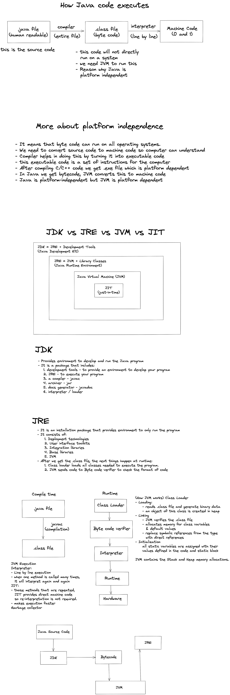

**Literals:** Java Literals are syntactic representations of boolean, character, numeric, or string data.
Example: 4 is an integer literal.

**Identifiers:** Identifiers are the names of variables, methods, classes, packages and interfaces

* Octal values are denoted in Java by a leading zero. Normal decimal numbers cannot have a leading zero.
* Thus, the seemingly valid value 09 will produce an error from the compiler, since 9 is outside of octal’s 0 to 7 range.
* 
* You signify a hexadecimal constant with a leading zero-x, (0x or 0X).
* The range of a hexadecimal digit is 0 to 15, so A through F (or a through f ) are substituted for 10 through 15.
* 
* When a literal value is assigned to a byte or short variable, no error is generated if the literal value is within the
* range of the target type. An integer literal can always be assigned to a long variable. However, to specify a long
* literal, you will need to explicitly tell the compiler that the literal value is of type long. You do this by appending
* an upper- or lowercase L to the literal.
* 
* Beginning with JDK 7, you can also specify integer literals using binary. To do so, prefix the value with 0b or 0B.
* For example, this specifies the decimal value 10 using a binary literal: int x = 0b1010;
* 
* int x = 123_456_789;
* the value given to x will be 123,456,789. The underscores will be ignored.
* 
* Floating-point literals in Java default to double precision.
* To specify a float literal, you must append an F or f to the constant.
* 
* Hexadecimal floating-point literals are also supported, but they are rarely used.
* They must be in a form similar to scientific notation, but a P or p, rather than an E or e, is used.
* For example, 0x12.2P2 is a valid floating-point literal. The value following the P, called the binary exponent,
* indicates the power-of-two by which the number is multiplied. Therefore, 0x12.2P2 represents 72.5.
* 
* double num = 9_423_497_862.0;
* the value given to num will be 9,423,497,862.0
* double num = 9_423_497.1_0_9;
* In this case, the fractional part is .109

* Boolean literals are simple. There are only two logical values that a boolean value can have, true and false.
* The values of true and false do not convert into any numerical representation.
* The true literal in Java does not equal 1, nor does the false literal equal 0.
* 
* As you may know, in some other languages, including C/C++, strings are implemented as arrays of characters.
* However, this is not the case in Java. Strings are actually object types.
* Because Java implements strings as objects, Java includes extensive string-handling capabilities that are both powerful
* and easy to use.
* 
* The remainder a % b is defined such that (a / b) * b + a % b is always equal to a :
* System.out.println(-15 % 2);    // -1
* System.out.println(15 % -2);    // 1
* 
#### Type Conversion and Casting:

Java’s Automatic Conversions
When one type of data is assigned to another type of variable, an automatic type conversion will take place if the
following two conditions are met:
• The two types are compatible.
• The destination type is larger than the source type.
Java also performs an automatic type conversion when storing a literal integer constant into variables of type
byte, short, long, or char.

Casting Incompatible Types
Although the automatic type conversions are helpful, they will not fulfill all needs. For example, what if you want to
assign an int value to a byte variable? This conversion will not be performed automatically, because a byte is smaller
than an int. This kind of conversion is sometimes called a narrowing conversion, since you are explicitly making the
value narrower so that it will fit into the target type.

For example, the following fragment casts an int to a byte. If the integer’s value is larger than the range of a byte,
it will be reduced modulo (the remainder of an integer division by the) byte’s range.
int a;
byte b;
b = (byte) a;

A different type of conversion will occur when a floating-point value is assigned to an integer type: truncation.

Automatic Type Promotion in Expressions:

int a = 257;
byte b = (byte)a;
When the value 257 is cast into a byte variable, the result is the remainder of the division of 257 by 256
(the range of a byte), which is 1 in this case.


       byte a = 40;
       byte b = 50;
       byte c = 100;
       int d = a * b / c;
The result of the intermediate term a * b easily exceeds the range of either of its byte operands.
To handle this kind of problem, Java automatically promotes each byte, short, or char operand to int when evaluating
an expression. This means that the subexpression a*b is performed using integers—not bytes.
byte b = 50;
b = b * 2; // Error! Cannot assign an int to a byte!
The code is attempting to store 50 * 2, a perfectly valid byte value, back into a byte variable. However, because the
operands were automatically promoted to int when the expression was evaluated, the result has also been promoted to int.

The Type Promotion Rules:

Java defines several type promotion rules that apply to expressions.
They are as follows: First, all byte, short, and char values are promoted to int, as just described.
Then, if one operand is a long, the whole expression is promoted to long. If one operand is a float,
the entire expression is promoted to float. If any of the operands are double, the result is double.

class Promote {
public static void main(String args[]) {
byte b = 42;
char c = 'a';
short s = 1024;
int i = 50000;
float f = 5.67f;
double d = .1234;
double result = (f * b) + (i / c) - (d * s);
System.out.println((f * b) + " + " + (i / c) + " - " + (d * s));
System.out.println("result = " + result);
}
}
Let’s look closely at the type promotions that occur in this line from the program:

     double result = (f * b) + (i / c) - (d * s);

In the first subexpression, f * b, b is promoted to a float and the result of the subexpression is float.
Next, in the subexpression i/c, c is promoted to int, and the result is of type int. Then, in d * s, the value of s is
promoted to double, and the type of the subexpression is double. Finally, these three intermediate values, float, int,
and double, are considered. The outcome of float plus an int is a float. Then the resultant float minus the last double
is promoted to double, which is the type for the final result of the expression.


**Q) Why Java is not 100% Object-oriented?**

Because of Primitive data types namely:

boolean, byte, char, int, float, double, long, short

we have wrapper classes which actually “wrap” the primitive data type into an object of that class.

Q) Why pointers are not used in Java? Mostly asked in java interview questions and Answers in MNC to check you basic knowledge of java and programming languages and logics behind them.
Because :
1) They are unsafe.

2) Increases the complexity of the program and since Java is known for its  simplicity of code, adding the concept of pointers will be contradicting.

3) Since JVM is responsible for implicit memory allocation, thus in order to  avoid direct access to memory by the user,  pointers are discouraged in Java

Q)  What is JIT compiler in Java?
The Just-In-Time (JIT) compiler is a component of the Java Runtime Environment (JRE). It improves the performance of Java applications by compiling bytecodes to native machine code at run time. When a Java program is run JVM launched that interprets the byte code and provides result.

Q) Why String is immutable in java?
1) String pool requires string to be immutable otherwise shared reference can be changed from anywhere.

2) security because string is shared on different area like file system, networking connection, database connection , having immutable string allows you to be secure and safe because no one can change reference of string once it gets created.

Q) What is a marker interface?

A Marker interface can be defined as the interface having no data member and member functions. In simpler terms, an empty interface is called the Marker interface.
serializable and clonable interface

Q) Can you override a private or static method in Java?

As I have told you in previous videos : method overriding is a good topic to ask trick questions in Java.

1) you can not override a private or static method in Java.

2) you cannot override a private method in sub class because it's not accessible there, what you do is create another private method with the same name in the child class.

3) For static methods if you create a similar method with same return type and same method arguments in child class then it will hide the superclass method, this is known as method hiding.

Q) Does “finally” always execute in Java?
Not in following cases
“System.exit()” function
system crash

Q) What Methods Does the Object Class Have?
Java.lang.Object class, parent of all has following methods :

protected Object clone() throws CloneNotSupportedException
Creates and returns a copy of this object.

public boolean equals(Object obj)
Indicates whether some other object is “equal to” this one.

protected void finalize() throws Throwable
Called by the garbage collector on an object when garbagecollection   determines that there are no more references to the object.

public final Class getClass() : Returns the runtime class of an object.

public int hashCode(): Returns a hash code value for the object.


Q) How Can You Make a Class Immutable?
1) Make the class final, so that no other classes can extend it.
2) Make all fields private so that direct access is not allowed.
3) Do not provide setter methods for variables.
4) Make all mutable fields final so that it’s value can be assigned only once.
5) Initialize all the fields via a constructor performing a deep copy.
6) Perform cloning of objects in the getter methods to return a copy rather than returning the actual object reference.
7) If the instance fields include references to mutable objects, don’t allow those objects to be changed:
    a) Do not provide methods that modify the mutable objects.
    b) Do not share references to the mutable objects. Never store references to external, mutable objects passed to the constructor; if necessary, create copies, and store references to the copies.
    c) Similarly, create copies of your internal mutable objects when necessary to avoid returning the originals in your methods.
8) Use interfaces to define immutable objects, as interfaces cannot be extended (implemented) by others.
9) Use read-only interfaces to allow access to class fields.
10) Use a factory method to create instances of the class.
11) Use the clone() method to return a copy of the object.
12) Use the final keyword so that the methods can’t be overridden.

Q) What is singleton class in Java and how can we make a class singleton?
Singleton class is a class which allows only one instance of the class at a time. It is used in logging, driver objects, caching and thread pool. To make a class singleton, we need to follow these steps:

1) Make constructor as private.
2) Write a static method that has return type object of this singleton class. Here, the concept of Lazy initialization is used to write this static method.
3) In Lazy initialization, we do not create the object until it is required.
4) To maintain singleton property, we need to follow these steps:
    a) If object is not created, create it.
    b) If the object is created, simply return it.
5) To prevent cloning of singleton object, we can override clone() method and throw exception in that method.
6) To prevent serialization of singleton class, we can override readResolve() method.
7) To prevent reflection, we can throw exception from constructor if instance already exists.
8) To prevent multiple instances in the same class loader, we can use ClassLoader mechanism.
9) To prevent multiple instances from multiple class loaders, we can use the concept of the registry of singletons.
10) To prevent multiple instances in a distributed environment, we can use the concept of the registry of singletons.'
11) To prevent multiple instances in a multithreaded environment, we can use the concept of double-checked locking.
12) To prevent multiple instances in a multithreaded environment, we can use the concept of the synchronized keyword.

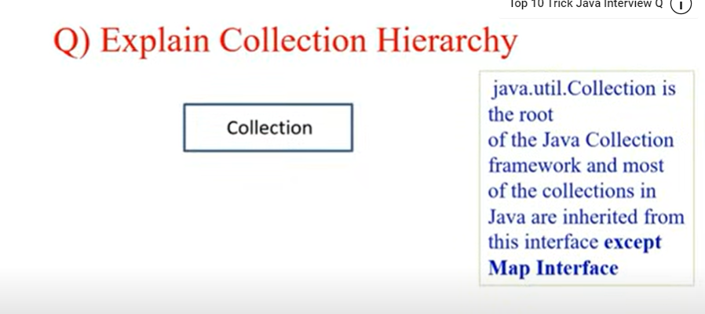
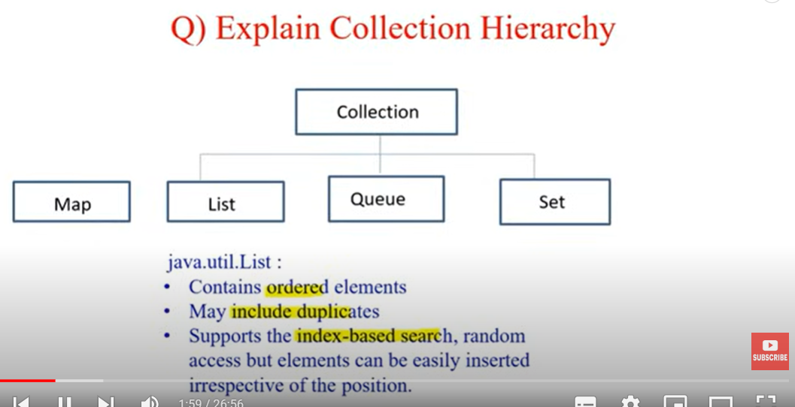
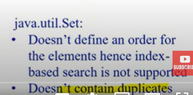

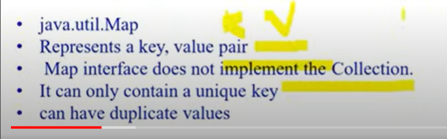
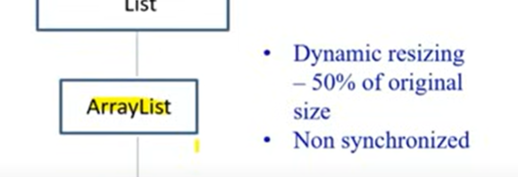
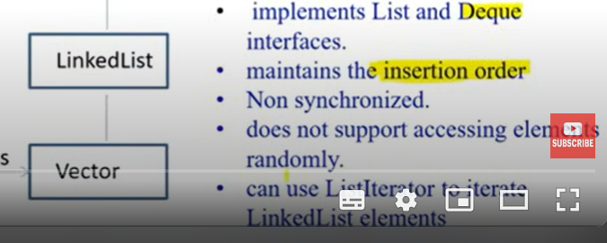
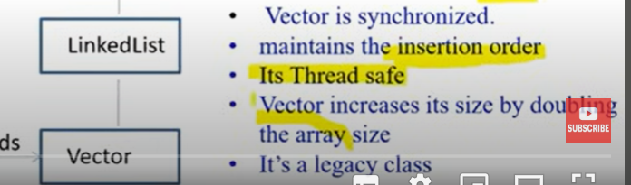

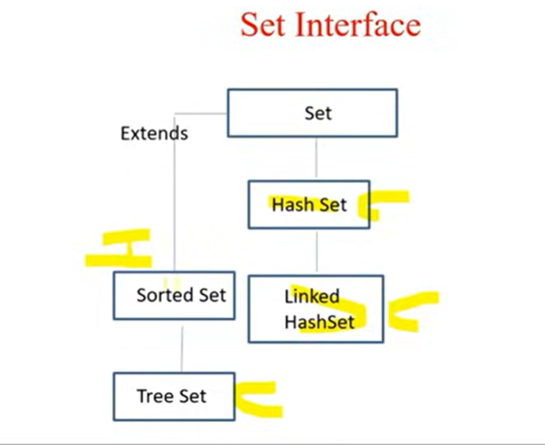
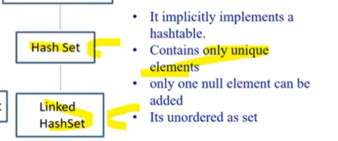

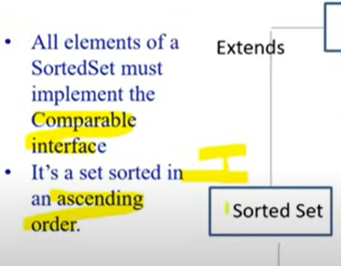
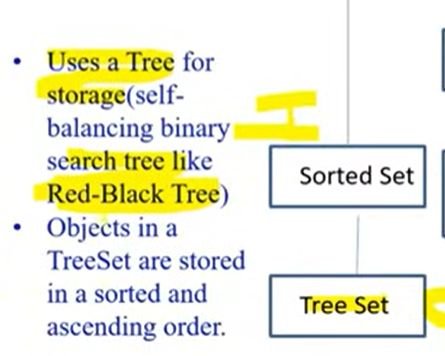
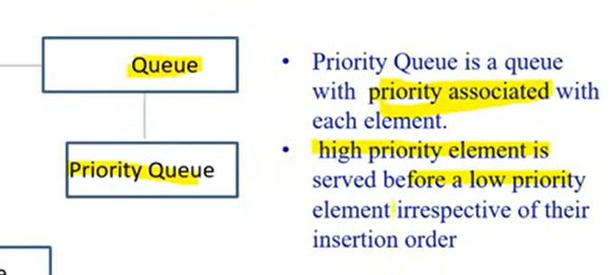
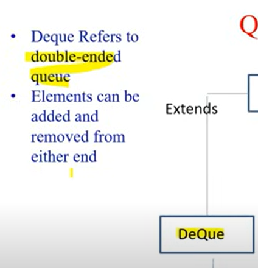
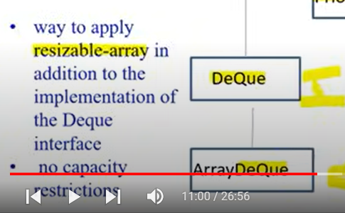
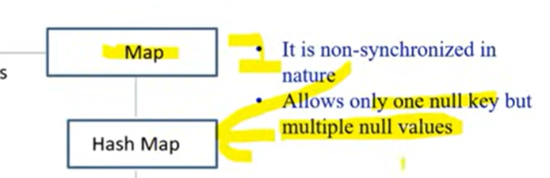

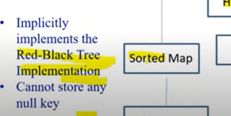
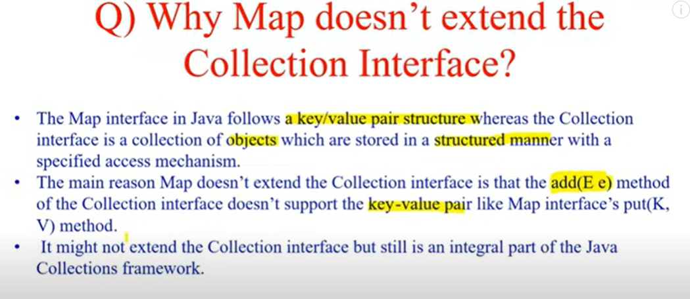
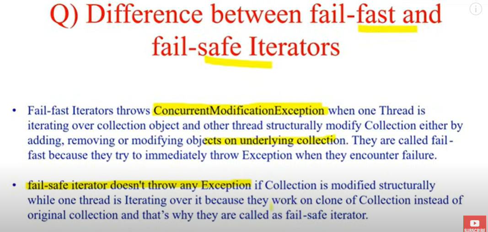
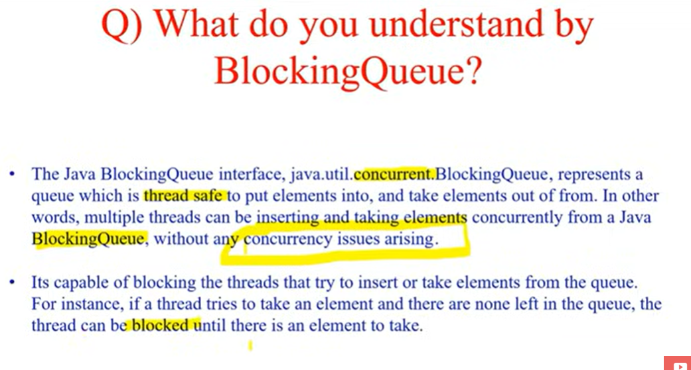
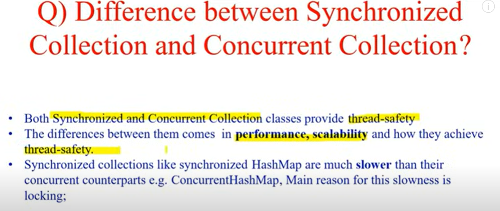
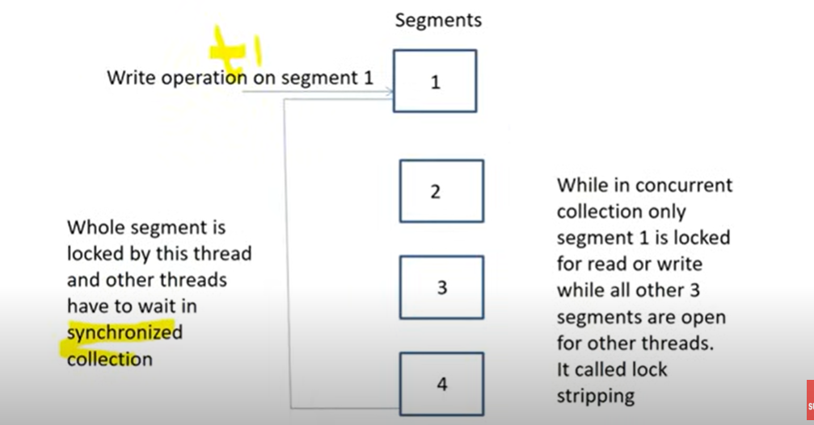
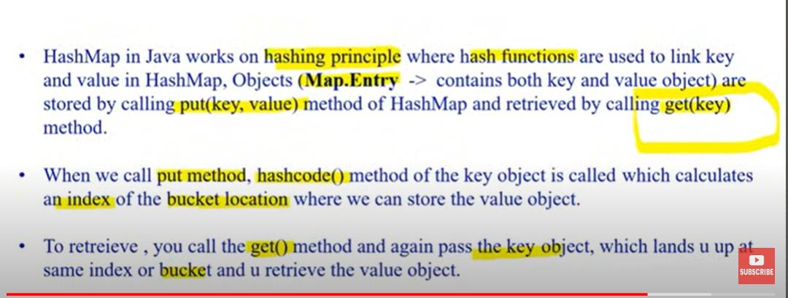
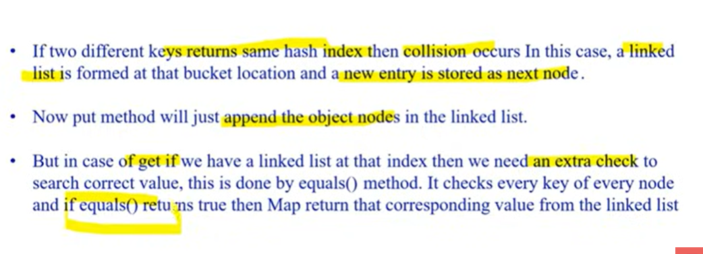
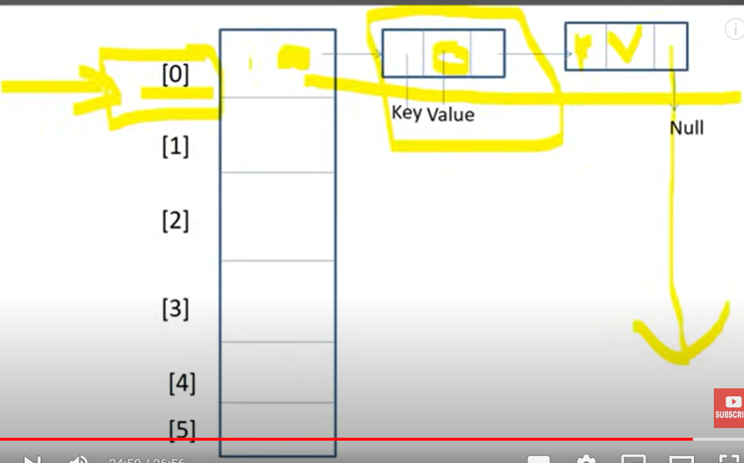


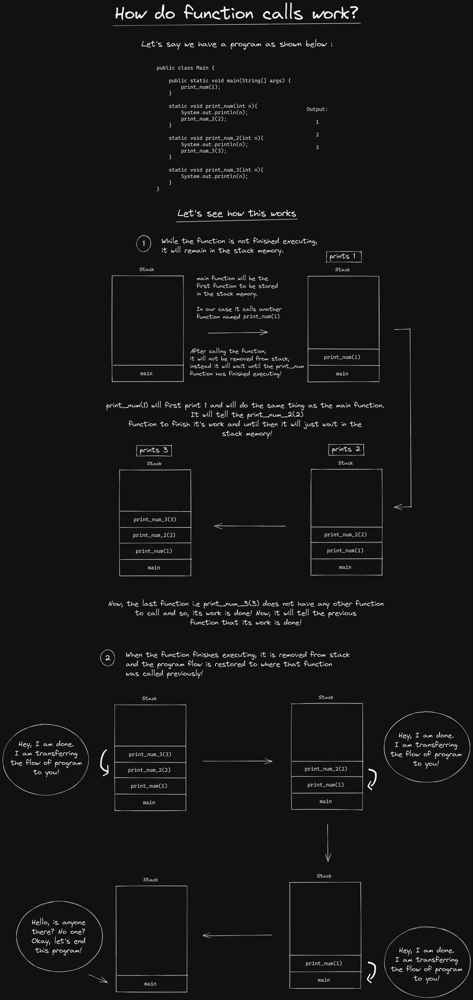
## Equals vs HashCode
equals(Object obj): a method provided by java.lang.Object that indicates whether some other object passed as an argument is "equal to" the current instance. The default implementation provided by the JDK is based on memory location — two objects are equal if and only if they are stored in the same memory address.

hashcode(): a method provided by java.lang.Object that returns an integer representation of the object memory address. By default, this method returns a random integer that is unique for each instance. This integer might change between several executions of the application and won't stay the same

How equals and hashcode contract works in java ?

The default implementation is not enough to satisfy business needs, especially if we're talking about a huge application that considers two objects as equal when some business fact happens. In some business scenarios, developers provide their own implementation in order to force their own equality mechanism regardless the memory addresses.

As per the Java documentation in perspective of equal and hashcode contract, developers should override both methods in order to achieve a fully working equality mechanism — it's not enough to just implement the equals() method.


### class
A class is a template for an object, and an object is an instance of a class.
A class creates a new data type that can be used to create objects.

When you declare an object of a class, you are creating an instance of that class.
Thus, a class is a logical construct. An object has physical reality. (That is, an object occupies space in memory.)

Objects are characterized by three essential properties: state, identity, and behavior.
The state of an object is a value from its data type. The identity of an object distinguishes one object from another.
It is useful to think of an object’s identity as the place where its value is stored in memory.
The behavior of an object is the effect of data-type operations.

The dot operator links the name of the object with the name of an instance variable.
Although commonly referred to as the dot operator, the formal specification for Java categorizes the . as a separator.
The 'new' keyword dynamically allocates(that is, allocates at run time)memory for an object & returns a reference to it.
This reference is, more or less, the address in memory of the object allocated by new.
This reference is then stored in the variable.
Thus, in Java, all class objects must be dynamically allocated.

Box mybox; // declare reference to object

mybox = new Box(); // allocate a Box object

The first line declares mybox as a reference to an object of type Box. At this point, mybox does not yet refer to an
actual object. The next line allocates an object and assigns a reference to it to mybox. After the second line executes,
you can use mybox as if it were a Box object. But in reality, mybox simply holds, in essence, the memory address of the
actual Box object.

The key to Java’s safety is that you cannot manipulate references as you can actual pointers.
Thus, you cannot cause an object reference to point to an arbitrary memory location or manipulate it like an integer.

A Closer Look at new:

classname class-var = new classname ( );

Here, class-var is a variable of the class type being created. The classname is the name of the class that is being
instantiated. The class name followed by parentheses specifies the constructor for the class. A constructor defines
what occurs when an object of a class is created.

#### You might be wondering why you do not need to use new for such things as integers or characters.
The answer is that Java’s primitive types are not implemented as objects.
Rather, they are implemented as “normal” variables.
This is done in the interest of efficiency.

It is important to understand that new allocates memory for an object during run time.

Box b1 = new Box();

Box b2 = b1;\
b1 and b2 will both refer to the same object. The assignment of b1 to b2 did not allocate any memory or copy any part
of the original object. It simply makes b2 refer to the same object as does b1. Thus, any changes made to the object
through b2 will affect the object to which b1 is referring, since they are the same object.
When you assign one object reference variable to another object reference variable, you are not creating a copy of the
object, you are only making a copy of the reference.

int square(int i){\
return i * i;\
}\

A parameter is a variable defined by a method that receives a value when the method is called. For example,
in square( int i), i is a parameter. An argument is a value that is passed to a method when it is invoked.
For example, square(100) passes 100 as an argument. Inside square( ), the parameter i receives that value.

NOTE:
Bus bus = new Bus();
lhs(reference i.e. bus) is looked be compiler & rhs (object i.e. new Bus()) is looked by jvm


### constructor

The this Keyword:
Sometimes a method will need to refer to the object that invoked it. To allow this, Java defines the this keyword.
this can be used inside any method to refer to the current object. That is, this is always a reference to the object on
which the method was invoked.

##### final Keyword:
A field can be declared as final. Doing so prevents its contents from being modified, making it, essentially, a constant.
This means that you must initialize a final field when it is declared.

It is a common coding convention to choose all uppercase identifiers for final fields:\
##### final int FILE_OPEN = 2;

Unfortunately, final guarantees immutability only when instance variables are primitive types, not reference types.
If an instance variable of a reference type has the final modifier, the value of that instance variable (the reference
to an object) will never change—it will always refer to the same object—but the value of the object itself can change.
````
final int x = 10;
x = 20; // Compilation error

````
When you declare a reference type variable as final, it means the reference (i.e., memory address) cannot be changed, but the contents of the object it points to can be changed.
````
final List<String> names = new ArrayList<>();
names.add("Alice"); // OK
names = new ArrayList<>(); // Compilation error
````
Thus, immutability is not guaranteed, because the internal state (the list contents) can still change.

#### The finalize( ) Method:
Sometimes an object will need to perform some action when it is destroyed.
To handle such situations, Java provides a mechanism called finalization. By using finalization,
you can define specific actions that will occur when an object is just about to be reclaimed by the garbage collector.
To add a finalizer to a class, you simply define the finalize( ) method. The Java run time calls that method whenever
it is about to recycle an object of that class. Right before an asset is freed, the Java run time calls the finalize( )
method on the object.
````
protected void finalize( ) {
// finalization code here
}
````

Constructors:

Once defined, the constructor is automatically called when the object is created, before the new operator completes.
Constructors look a little strange because they have no return type, not even void.
This is because the implicit return type of a class’ constructor is the class type itself.

In the line
Box mybox1 = new Box();
new Box( ) is calling the Box( ) constructor.


Inheritance and constructors in Java:

In Java, constructor of base class with no argument gets automatically called in derived class constructor.
For example, output of following program given below is:

Base Class Constructor Called\
Derived Class Constructor Called
````
// filename: Main.java
class Base {
Base() {
System.out.println("Base Class Constructor Called ");
}
}

class Derived extends Base {
Derived() {
System.out.println("Derived Class Constructor Called ");
}
}

public class Main {
public static void main(String[] args) {
Derived d = new Derived();
}
}
````

Any class will have a default constructor, does not matter if we declare it in the class or not. If we inherit a class,
then the derived class must call its super class constructor. It is done by default in derived class.
If it does not have a default constructor in the derived class, the JVM will invoke its default constructor and call
the super class constructor by default. If we have a parameterised constructor in the derived class still it calls the
default super class constructor by default. In this case, if the super class does not have a default constructor,
instead it has a parameterised constructor, then the derived class constructor should call explicitly call the
parameterised super class constructor.


## can we restrict visiblity of derived methods in java?
No
we can't restrict we can make it more accessible.


### Abstraction vs Encapsulation

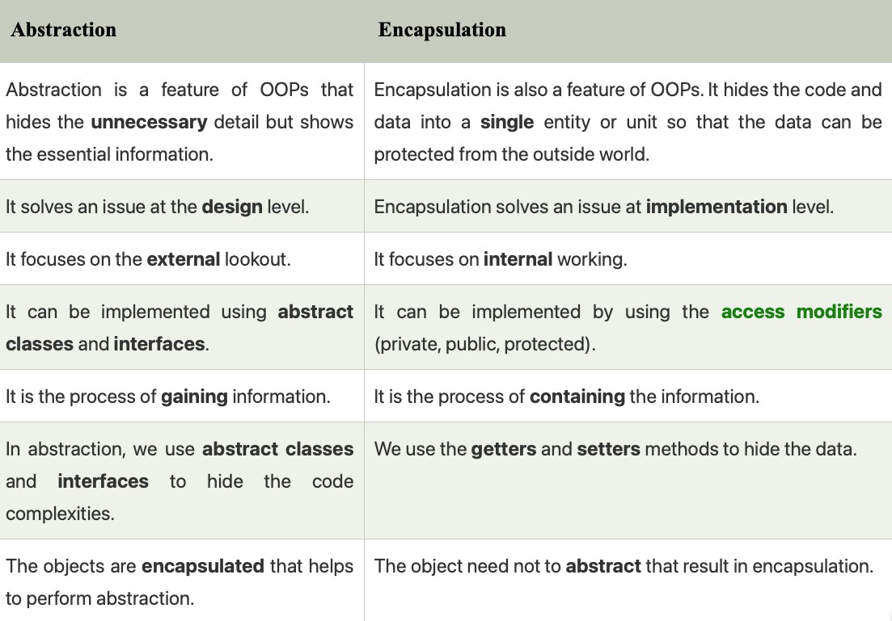


### enum
An enumeration is a list of named constants.
In Java, an enumeration defines a class type.
By making enumerations into classes, the capabilities of the enumeration are greatly expanded.

An enumeration is created using the enum keyword.
Enum declaration can be done outside a Class or inside a Class but not inside a Method
We can declare main() method inside enum. Hence we can invoke enum directly from the Command Prompt.
````
/* internally above enum Color is converted to (Check Example.java)
class Color
{
public static final Color Red = new Color();
public static final Color Blue = new Color();
public static final Color Green = new Color();
}*/
````
#### Enum and Inheritance :
-All enums implicitly extend java.lang.Enum class. As a class can only extend one parent in Java,
so an enum cannot extend anything else.
-An enum cannot be a superclass.\
-toString() method is overridden in java.lang.Enum class, which returns enum constant name.\
-enum can implement many interfaces.

Two enumeration constants can be compared for equality by using the == relational operator.

values(), ordinal() and valueOf() methods :
These methods are present inside java.lang.Enum.
-values() method can be used to return all values present inside enum.
-Order is important in enums.By using ordinal() method, each enum constant index can be found,
just like array index.
-valueOf() method returns the enum constant of the specified string value, if exists.

### enum and constructor :
-enum can contain constructor and it is executed separately for each enum constant at the time
of enum class loading.\
-We can’t create enum objects explicitly and hence we can’t invoke enum constructor directly.\
-And the constructor cannot be the public or protected it must have private or default modifiers.\
-Why? if we create public or protected, it will allow initializing more than one objects.\
-This is totally against enum concept.

enum and methods :
enum can contain concrete methods only i.e. no any abstract method.

You can compare for equality an enumeration constant with any other object by using equals( ),
which overrides the equals( ) method defined by Object.
Although equals( ) can compare an enumeration constant to any other object, those two objects
will be equal only if they both refer to the same constant,within the same enumeration.
Simply having ordinal values in common will not cause equals( ) to return true if the two constants
are from different enumerations. Remember, you can compare two enumeration references for equality by using ==.


## inheritance
To inherit a class, you simply incorporate the definition of one class into another by using the extends keyword.
````
class subclass-name extends superclass-name { // body of class
}
````
You can only specify one superclass for any subclass that you create. Java does not support the inheritance of
multiple superclasses into a single subclass. You can, as stated, create a hierarchy of inheritance in which a subclass
becomes a superclass of another subclass. However, no class can be a superclass of itself.

Although a subclass includes all of the members of its superclass, it cannot access those members of the superclass
that have been declared as private.

A Superclass Variable Can Reference a Subclass Object:
It is important to understand that it is the type of the reference variable—not the type of the object that it refers
to—that determines what members can be accessed.
When a reference to a subclass object is assigned to a superclass reference variable, you will have access only to
those parts of the object defined by the superclass.

plainbox      =  weightbox;
(superclass)     (subclass)

SUPERCLASS ref = new SUBCLASS();

HERE ref can only access methods which are available in SUPERCLASS

Using super:
Whenever a subclass needs to refer to its immediate superclass, it can do so by use of the keyword super.
super has two general forms. The first calls the superclass’ constructor.
The second is used to access a member of the superclass that has been hidden by a member of a subclass.
````
BoxWeight(double w, double h, double d, double m) {
super(w, h, d); // call superclass constructor
weight = m;
}
````

Here, BoxWeight( ) calls super( ) with the arguments w, h, and d. This causes the Box constructor to be called,
which initializes width, height, and depth using these values. BoxWeight no longer initializes these values itself.
It only needs to initialize the value unique to it: weight. This leaves Box free to make these values private if desired.

Thus, super( ) always refers to the superclass immediately above the calling class.
This is true even in a multileveled hierarchy.

class Box {
private double width;
private double height;
private double depth;

     // construct clone of an object

     Box(Box ob) { // pass object to constructor
       width = ob.width;
       height = ob.height;
       depth = ob.depth;
     }
}

class BoxWeight extends Box {
double weight; // weight of box

     // construct clone of an object

     BoxWeight(BoxWeight ob) { // pass object to constructor
        super(ob);
        weight = ob.weight;
     }
}

Notice that super() is passed an object of type BoxWeight—not of type Box.This still invokes the constructor Box(Box ob).
NOTE: A superclass variable can be used to reference any object derived from that class.
Thus, we are able to pass a BoxWeight object to the Box constructor.Of course,Box only has knowledge of its own members.

A Second Use for super
The second form of super acts somewhat like this, except that it always refers to the superclass of the subclass in
which it is used.

super.member

Here, member can be either a method or an instance variable. This second form of super is most applicable to situations
in which member names of a subclass hide members by the same name in the superclass.

super( ) always refers to the constructor in the closest superclass. The super( ) in BoxPrice calls the constructor in
BoxWeight. The super( ) in BoxWeight calls the constructor in Box. In a class hierarchy, if a superclass constructor
requires parameters, then all subclasses must pass those parameters “up the line.” This is true whether or not a
subclass needs parameters of its own.

If you think about it, it makes sense that constructors complete their execution in order of derivation.
Because a superclass has no knowledge of any subclass, any initialization it needs to perform is separate from and
possibly prerequisite to any initialization performed by the subclass. Therefore, it must complete its execution first.

NOTE: If super( ) is not used in subclass' constructor, then the default or parameterless constructor of each superclass
will be executed.


Using final with Inheritance:

The keyword final has three uses:

# First, it can be used to create the equivalent of a named constant.

# Using final to Prevent Overriding:
To disallow a method from being overridden, specify final as a modifier at the start of its declaration.
Methods declared as final cannot be overridden.
Methods declared as final can sometimes provide a performance enhancement: The compiler is free to inline calls to them
because it “knows” they will not be overridden by a subclass. When a small final method is called, often the Java
compiler can copy the bytecode for the subroutine directly inline with the compiled code of the calling method, thus
eliminating the costly overhead associated with a method call. Inlining is an option only with final methods.
Normally, Java resolves calls to methods dynamically, at run time. This is called late binding. However, since final
methods cannot be overridden, a call to one can be resolved at compile time. This is called early binding.

# Using final to Prevent Inheritance:
Sometimes you will want to prevent a class from being inherited. To do this, precede the class declaration with final.
NOTE: Declaring a class as final implicitly declares all of its methods as final, too.
As you might expect, it is illegal to declare a class as both abstract and final since an abstract class is incomplete
by itself & relies upon its subclasses to provide complete implementations.

# NOTE: Although static methods can be inherited ,there is no point in overriding them in child classes because the
method in parent class will run always no matter from which object you call it. That is why static interface methods
cannot be inherited because these method will run from the parent interface and no matter if we were allowed to
override them, they will always run the method in parent interface.
That is why static interface method must have a body.

NOTE : Polymorphism does not apply to instance variables.

### interface

Multiple inheritance is not available in java.
(Same functions in 2 classes it will skip that hence no multiple inheritance)

Instead we have java interfaces. they have abstract functions (no body of functions)

Interface is like class but not completely. it is like an abstract class.
By default functions are public and abstract in interface.
variables are final and static by default in interface.

Interfaces specify only what the class is doing, not how it is doing it.
The problem with MULTIPLE INHERITANCE is that two classes may define different ways of doing the same thing,
and the subclass can't choose which one to pick.

Key difference between a class and an interface: a class can maintain state information
(especially through the use of instance variables), but an interface cannot.

Using interface, you can specify a set of methods that can be implemented by one or more classes.
Although they are similar to abstract classes, interfaces have an additional capability:
A class can implement more than one interface. By contrast, a class can only inherit a single superclass
(abstract or otherwise).

Using the keyword interface, you can fully abstract a class’ interface from its implementation.
That is, using interface, you can specify what a class must do, but not how it does it.

Interfaces are syntactically similar to classes, but they lack instance variables, and, as a general rule,
their methods are declared without any body.

By providing the interface keyword, Java allows you to fully utilize the “one interface, multiple methods”
aspect of polymorphism.

NOTE: Interfaces are designed to support dynamic method resolution at run time.
Normally, in order for a method to be called from one class to another, both classes need to be present at compile time
so the Java compiler can check to ensure that the method signatures are compatible. This requirement by itself makes for
a static and nonextensible classing environment. Inevitably in a system like this, functionality gets pushed up higher
and higher in the class hierarchy so that the mechanisms will be available to more and more subclasses. Interfaces are
designed to avoid this problem. They disconnect the definition of a method or set of methods from the inheritance
hierarchy. Since interfaces are in a different hierarchy from classes, it is possible for classes that are unrelated
in terms of the class hierarchy to implement the same interface. This is where the real power of interfaces is realized.

Beginning with JDK 8, it is possible to add a default implementation to an interface method.
Thus, it is now possible for interface to specify some behavior.However, default methods constitute what is, in essence,
a special-use feature, and the original intent behind interface still remains.

Variables can be declared inside of interface declarations.
NOTE: They are implicitly final and static, meaning they cannot be changed by the implementing class.
They must also be initialized. All methods and variables are implicitly public.

NOTE: The methods that implement an interface must be declared public. Also, the type signature of the implementing
method must match exactly the type signature specified in the interface definition.

It is both permissible and common for classes that implement interfaces to define additional members of their own.

NOTE:
You can declare variables as object references that use an interface rather than a class type.
This process is similar to using a superclass reference to access a subclass object.
Any instance of any class that implements the declared interface can be referred to by such a variable.
When you call a method through one of these references, the correct version will be called based on the actual instance
of the interface being referred to. Called at run time by the type of object it refers to.
The method to be executed is looked up dynamically at run time, allowing classes to be created later than the code which
calls methods on them.
The calling code can dispatch through an interface without having to know anything about the “callee.”

CAUTION: Because dynamic lookup of a method at run time incurs a significant overhead when compared with the normal
method invocation in Java, you should be careful not to use interfaces casually in performance-critical code.


Nested Interfaces:

An interface can be declared a member of a class or another interface. Such an interface
is called a member interface or a nested interface. A nested interface can be declared as public, private, or protected.
This differs from a top-level interface, which must either be declared as public or use the default access level.

// This class contains a member interface.
class A {
// this is a nested interface
public interface NestedIF {
boolean isNotNegative(int x);
}
}
// B implements the nested interface.
class B implements A.NestedIF {
public boolean isNotNegative(int x) {
return x < 0 ? false: true;
}
}
class NestedIFDemo {
public static void main(String args[]) {
// use a nested interface reference
A.NestedIF nif = new B();
if(nif.isNotNegative(10))
System.out.println("10 is not negative");
if(nif.isNotNegative(-12))
System.out.println("this won't be displayed");
}
}

Interfaces Can Be Extended:
One interface can inherit another by use of the keyword extends. The syntax is the same as for inheriting classes.
Any class that implements an interface must implement all methods required by that interface, including any that are
inherited from other interfaces.


Default Interface Methods (aka extension method) :
A primary motivation for the default method was to provide a means by which interfaces could be expanded without breaking existing code.
i.e. suppose you add another method without body in an interface. Then you will have to provide the body of that method
in all the classes that implement that interface.
Ex:
default String getString() {
return "Default String";
}

For example, you might have a class that implements two interfaces.
If each of these interfaces provides default methods, then some behavior is inherited from both.
# In all cases, a class implementation takes priority over an interface default implementation.
# In cases in which a class implements two interfaces that both have the same default method, but the class does not
override that method, then an error will result.
#### In cases in which one interface inherits another, with both defining a common default method, the inheriting
interface’s version of the method takes precedence.

NOTE: static interface methods are not inherited by either an implementing class or a subinterface.
i.e. static interface methods should have a body! They cannot be abstract.

NOTE : when overriding methods, the access modifier should be same or better i.e. if in Parent Class it was protected, then then overridden should be either protected or public.


## overloading
Overloading Methods:
In Java, it is possible to define two or more methods within the same class that share the same name,
as long as their parameter declarations are different.
While overloaded methods may have different return types, the return type alone is insufficient to distinguish two
versions of a method. When Java encounters a call to an overloaded method, it simply executes the version of the method
whose parameters match the arguments used in the call.
In some cases, Java’s automatic type conversions can play a role in overload resolution.

class OverloadDemo {
void test(double a){
System.out.println("Inside test(double) a: " + a);
}
}
class Overload {
public static void main(String args[]) {
OverloadDemo ob = new OverloadDemo();
int i = 88;
ob.test(i);        // this will invoke test(double)
ob.test(123.2);    // this will invoke test(double)
}
}
As you can see, this version of OverloadDemo does not define test(int). Therefore, when test( ) is called with an
integer argument inside Overload, no matching method is found. However, Java can automatically convert an integer
into a double, and this conversion can be used to resolve the call. Therefore, after test(int) is not found,
Java elevates i to double and then calls test(double).
Of course, if test(int) had been defined, it would have been called instead.
Java will employ its automatic type conversions only if no exact match is found.

Returning Objects:

// Returning an object.
class Test {
int a;
Test(int i) {
a = i;
}
Test incrByTen() {
Test temp = new Test(a+10);
return temp;
}
}
class RetOb {
public static void main(String args[]) {
Test ob1 = new Test(2);
Test ob2;
ob2 = ob1.incrByTen();
System.out.println("ob1.a: " + ob1.a);
System.out.println("ob2.a: " + ob2.a);
}
}

Output:
ob1.a: 2
ob2.a: 12

As you can see, each time incrByTen( ) is invoked, a new object is created, and a reference to it is returned to the
calling routine. Since all objects are dynamically allocated using new, you don’t need to worry about an object going
out-of-scope because the method in which it was created terminates. The object will continue to exist as long as there
is a reference to it somewhere in your program. When there are no references to it, the object will be reclaimed the
next time garbage collection takes place.


## overriding

In a class hierarchy, when a method in a subclass has the same name and type signature as a method in its superclass,
then the method in the subclass is said to override the method in the superclass. When an overridden method is called
from within its subclass, it will always refer to the version of that method defined by the subclass. The version of the
method defined by the superclass will be hidden.

Method overriding occurs only when the names and the type signatures of the two methods are identical.
If they are not, then the two methods are simply overloaded.

(Check display functions in box classes)

Dynamic Method Dispatch:

Dynamic method dispatch is the mechanism by which a call to an overridden method is resolved at run time, rather than
compile time. Dynamic method dispatch is important because this is how Java implements run-time polymorphism.
Let’s begin by restating an important principle: a superclass reference variable can refer to a subclass object.
When an overridden method is called through a superclass reference, Java determines which version of that method to
execute based upon the type of the object being referred to at the time the call occurs. Thus, this determination is
made at run time.
In other words, it is the type of the object being referred to (not the type of the reference variable)
that determines which version of an overridden method will be executed.

If B extends A then you can override a method in A through B with changing the return type of method to B.


## packages
Packages are containers for classes. They are used to keep the class name space compartmentalized.
For example, a package allows you to create a class named List, which you can store in your own package without
concern that it will collide with some other class named List stored elsewhere. Packages are stored in a hierarchical
manner and are explicitly imported into new class definitions.

The package is both a naming and a visibility control mechanism.

The following statement creates a package called MyPackage: package MyPackage;

Java uses file system directories to store packages. For example, the .class files for any classes you declare to be
part of MyPackage must be stored in a directory called MyPackage. Remember that case is significant, and the directory
name must match the package name exactly.

A package hierarchy must be reflected in the file system of your Java development system.
For example, a package declared as

    package java.awt.image;

needs to be stored in java\awt\image in a Windows environment. Be sure to choose your package names carefully.
You cannot rename a package without renaming the directory in which the classes are stored.

How does the Java run-time system know where to look for packages that you create? The answer has three parts.
- First, by default, the Java run-time system uses the current working directory as its starting point.
  Thus, if your package is in a subdirectory of the current directory, it will be found.
- Second, you can specify a directory path or paths by setting the CLASSPATH environmental variable.
- Third, you can use the -classpath option with java and javac to specify the path to your classes.

When a package is imported, only those items within the package declared as public will be available to non-subclasses
in the importing code.


### Understanding static:

When a member is declared static, it can be accessed before any objects of its class are created,
and without reference to any object. You can declare both methods and variables to be static.
The most common example of a static member is main( ).
main( ) is declared as static because it must be called before any objects exist.
Static method in Java is a method which belongs to the class and not to the object.

A static method can access only static data. It cannot access non-static data (instance variables)
A non-static member belongs to an instance. It's meaningless without somehow resolving which instance of a class you
are talking about. In a static context, you don't have an instance, that's why you can't access a non-static member
without explicitly mentioning an object reference.
In fact, you can access a non-static member in a static context by specifying the object reference explicitly :
public class Human {

    String message = "Hello World";

    public static void display(Human human){
        System.out.println(human.message);
    }

    public static void main(String[] args) {
        Human kunal = new Human();
        kunal.message = "Kunal's message";
        Human.display(kunal);
    }

}

A static method can call only other static methods and cannot call a non-static method from it.
A static method can be accessed directly by the class name and doesn’t need any object
A static method cannot refer to "this" or "super" keywords in anyway

If you need to do computation in order to initialize your static variables,
you can declare a static block that gets executed exactly once, when the class is first loaded.

// Demonstrate static variables, methods, and blocks.
class UseStatic {
static int a = 3;
static int b;
static void meth(int x) {
System.out.println("x = " + x);
System.out.println("a = " + a);
System.out.println("b = " + b);
}
static {
System.out.println("Static block initialized.");
b = a * 4;
}
public static void main(String args[]) {
meth(42);
}
}

As soon as the UseStatic class is loaded, all of the static statements are run. First, a is set to 3,
then the static block executes, which prints a message and then initializes b to a*4 or 12. Then main( ) is called,
which calls meth( ), passing 42 to x. The three println( ) statements refer to the two static variables a and b,
as well as to the local variable x.

Here is the output of the program:
Static block initialized. x = 42
a = 3
b = 12
Note: main method is static, since it must be accessible for an application to run, before any instantiation takes place.

NOTE: Only nested classes can be static.
NOTE: Static inner classes can have static variables

You cant override the inherited static methods, as in java overriding takes place by resolving the type of object at
run-time and not compile time, and then calling the respective method.
Static methods are class level methods, so it is always resolved during compile time.
Static INTERFACE METHODS are not inherited by either an implementing class or a sub-interface.

NOTE:
```` java
public class Static {

    // class Test  // ERROR
    static class Test{
        String name;

        public Test(String name) {
            this.name = name;
        }
    }

    public static void main(String[] args) {
        Test a = new Test("Kunal");

        Test b = new Test("Rahul");

        System.out.println(a.name); // Kunal
        System.out.println(b.name); // Rahul
    }
}
````
Because :
The static keyword may modify the declaration of a member type C within the body of a non-inner class or interface T.
Its effect is to declare that C is not an inner class. Just as a static method of T has no current instance of T in its
body, C also has no current instance of T, nor does it have any lexically enclosing instances.
Here, test does not have any instance of it's outer class Static. Neither does main.
But main & Test can have instances of each other.

### abstract

Sometimes you will want to create a superclass that only defines a generalized form that will be shared by all of its
subclasses, leaving it to each subclass to fill in the details. Such a class determines the nature of the methods that
the subclasses must implement.
You may have methods that must be overridden by the subclass in order for the subclass to have any meaning.
In this case, you want some way to ensure that a subclass does, indeed, override all necessary methods. Java’s solution
to this problem is the abstract method.
You can require that certain methods be overridden by subclasses by specifying the abstract type modifier.

        abstract type name(parameter-list);

These methods are sometimes referred to as subclass's responsibility because they have no implementation specified in
the superclass.
Thus, a subclass must override them—it cannot simply use the version defined in the superclass.

Any class that contains one or more abstract methods must also be declared abstract.
# There can be no objects of an abstract class.
# You cannot declare abstract constructors, or abstract static methods.
# You can declare static methods in abstract class.
Because there can be no objects for abstract class. If they had allowed to call abstract static methods,
it would that mean we are calling an empty method (abstract) through classname because it is static.
Any subclass of an abstract class must either implement all of the abstract methods in the superclass,
or be declared abstract itself.
Abstract classes can include as much implementation as they see fit i.e.there can be concrete methods(methods with body)
in abstract class.

Although abstract classes cannot be used to instantiate objects, they can be used to create object references,
because Java’s approach to run-time polymorphism is implemented through the use of superclass references.

A public constructor on an abstract class doesn't make any sense because you can't instantiate an abstract class directly
(can only instantiate through a derived type that itself is not marked as abstract)
Check: https://stackoverflow.com/questions/260666/can-an-abstract-class-have-a-constructor


Abstract class vs Interface:

Type of methods:
Interface can have only abstract methods.
Abstract class can have abstract and non-abstract methods. From Java 8, it can have default and static methods also.

Final Variables:
Variables declared in a Java interface are by default final.
An abstract class may contain non-final variables.

Type of variables:
Abstract class can have final, non-final, static and non-static variables.
Interface has only static and final variables.

Implementation:
Abstract class can provide the implementation of interface.
Interface can’t provide the implementation of abstract class.

Inheritance vs Abstraction:
A Java interface can be implemented using keyword “implements”
and abstract class can be extended using keyword “extends”.

Multiple implementation:
An interface can extend another Java interface only,
an abstract class can extend another Java class and implement multiple Java interfaces.

Accessibility of Data Members:
Members of a Java interface are public by default.
A Java abstract class can have class members like private, protected, etc.


#### access modifiers
Access Control:

How a member can be accessed is determined by the access modifier attached to its declaration.
Usually, you will want to restrict access to the data members of a class—allowing access only through methods.
Also, there will be times when you will want to define methods that are private to a class.

Java’s access modifiers are public, private, and protected. Java also defines a default access level.
protected applies only when inheritance is involved.

When no access modifier is used, then by default the member of a class is public within its own package,
but cannot be accessed outside of its package.

            │ Class │ Package │ Subclass │ Subclass │ World
            │       │         │(same pkg)│(diff pkg)│(diff pkg & not subclass)
────────────┼───────┼─────────┼──────────┼──────────┼──────────────────────────
public      │   +   │    +    │    +     │     +    │   +
────────────┼───────┼─────────┼──────────┼──────────┼──────────────────────────
protected   │   +   │    +    │    +     │     +    │
────────────┼───────┼─────────┼──────────┼──────────┼──────────────────────────
no modifier │   +   │    +    │    +     │          │
────────────┼───────┼─────────┼──────────┼──────────┼──────────────────────────
private     │   +   │         │          │          │

+ : accessible
  blank : not accessible

package packageOne;
public class Base
{
protected void display(){
System.out.println("in Base");
}
}

package packageTwo;
public class Derived extends packageOne.Base{
public void show(){
new Base().display();       // this is not working
new Derived().display();    // is working
display();//is working
}
}

protected allows access from subclasses and from other classes in the same package.
We can use child class to use protected member outside the package but only child class object can access it.
That's why any Derived class instance can access the protected method in Base.
The other line creates a Base instance (not a Derived instance!!).
And access to protected methods of that instance is only allowed from objects of the same package.

display();
-> allowed, because the caller, an instance of Derived has access to protected members and fields of its subclasses,
even if they're in different packages


new Derived().display();
-> allowed, because you call the method on an instance of Derived and that instance has access to the protected methods
of its subclasses

new Base().display();
-> not allowed because the caller's (the this instance) class is not defined in the same package like the Base class,
so this can't access the protected method. And it doesn't matter - as we see - that the current subclasses a class from
that package. That backdoor is closed ;)

Remember that any time talks about a subclass having an access to a superclass member, we could be talking about the
subclass inheriting the member, not simple accessing the member through a reference to an instance of the superclass.


class C
protected member;

// in a different package

class S extends C

    obj.member; // only allowed if type of obj is S or subclass of S

The motivation is probably as following. If obj is an S, class S has sufficient knowledge of its internals,
it has the right to manipulate its members, and it can do this safely.
If obj is not an S, it's probably another subclass S2 of C, which S has no idea of.
S2 may have not even been born when S is written. For S to manipulate S2's protected internals is quite dangerous.
If this is allowed, from S2's point of view, it doesn't know who will tamper with its protected internals and how,
this makes S2 job very hard to reason about its own state.

Now if obj is D, and D extends S, is it dangerous for S to access obj.member? Not really.
How S uses member is a shared knowledge of S and all its subclasses, including D. S as the superclass has the right to
define behaviours, and D as the subclass has the obligation to accept and conform.

For easier understanding, the rule should really be simplified to require obj's (static) type to be exactly S.
After all, it's very unusual and inappropriate for subclass D to appear in S. And even if it happens,
that the static type of obj is D, our simplified rule can deal with it easily by upcasting: ((S)obj).member


### Shadowing variable in Java

In Java, if the name of a derived class static function is the same as a base class static function then the base class static function shadows (or conceals) the derived class static function. also remember that static method is a class property, so if a static method is called from a class name or object having a class container then the method of that class is called not the object’s method.


What are defaults methods?
Default method is a way for adding  new methods to the interface without affecting the implementing classes. Hence with this new feature Java people defended many compile time errors that may arise due to unimplemented methods of interface.

The use of these default methods is “Backward Compatibility” which means if JDK modifies any Interface (without default method) then the classes which implement this Interface will break.

On the other hand, if you add the default method in an Interface then you will be able to provide the default implementation. This won’t affect the implementing classes.

Q) Is it necessary to override default methods of interface in java 8?
Default methods have dummy implementations.
Implementing classes if ok with dummy implementation then use dummy implementation of default methods
If not satisfied then they can override and provide their own implementation.

Q) Is the default keyword one of the access modifiers?
Default is not the access modifier like public or protected or public
Q) How to override default methods?

You can override the default method by keeping the same method signature (name + arguments)

Removing default keywords because in class default keyword is used in switch case to denote default case if no previous cases matched. So you cant use the Default keyword in Class

Adding Public as access modifier as in java 8, by default all methods are public so in child, u cant reduce the visibility of overridden default method.
Giving our own implementation.


Q) Why Static methods were introduced in JAVA8
Only reason for introducing static methods in the interface is that you can call those methods with just interface name. No Need to create a class and then its object.

Since Interface can never contain :
Constructors,
Static blocks,
Nothings are costly in terms of memory and performance.

Hence we don’t need to create an object and hence if you have everything static, then for interface rather than class

( You have this flexibility only after java 8, before that you need to create a class)


Q) Are Static Methods available to implementing classes by default?

Static methods are not available for implementing classes.

They are not default methods. They are static.